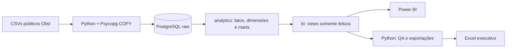

# Olist: crescimento, clientes e experiência

Case de portfólio para uma vaga de **Analista de Dados / BI — Negócios e Performance**. O objetivo não é apenas mostrar ferramentas, mas responder três perguntas:

1. O que aconteceu com o negócio?
2. Quais fatores explicam o resultado?
3. O que os dados indicam que deveríamos fazer?

## Artefatos prontos

- `outputs/01a03005-6971-71f1-a1b6-e623a39d25c2/case_olist_entrevista.pptx`: apresentação executiva de sete slides, com notas do apresentador.
- `outputs/01a03005-6971-71f1-a1b6-e623a39d25c2/portfolio_olist.xlsx`: workbook executivo, análises detalhadas e simulador de campanha.
- `power_bi/conexao_power_bi.md`: conexão PostgreSQL, relacionamentos e páginas recomendadas.
- `power_bi/medidas.dax`: medidas prontas para copiar no Power BI Desktop.

## Resumo executivo

No comparativo **jan–ago/2018 versus jan–ago/2017**:

- O GMV passou de **R$ 3,47 milhões para R$ 8,45 milhões**, alta de **143,4%**.
- **98,3% do crescimento veio do volume de pedidos**; o ticket médio cresceu apenas **1,4%**.
- A taxa de entrega no prazo caiu de **95,8% para 90,6%** e a nota média recuou de **4,23 para 4,14**.
- Somente **3,0% dos clientes** fizeram dois ou mais pedidos no histórico observado.
- Pedidos entregues com **8+ dias de atraso** tiveram nota média **1,73**, contra **4,30** nos pedidos entregues pelo menos três dias antes do prazo.
- As categorias que mais contribuíram para o crescimento foram `health_beauty` (**11,8%**) e `watches_gifts` (**10,7%**).

**Leitura de negócio:** a Olist ganhou escala principalmente por aquisição/volume, mas essa expansão não se converteu em recorrência e veio acompanhada de piora operacional. A oportunidade é combinar uma ação de segunda compra com recuperação de serviço para clientes afetados por atraso.

## Arquitetura



Separação de responsabilidades:

- **Python:** ingestão reproduzível, carga eficiente, validações e exportações.
- **PostgreSQL:** tipagem, chaves, regras de negócio, agregações, janelas, coortes e segmentação.
- **Power BI:** modelo semântico, medidas DAX e comunicação visual.
- **Excel:** cenário de campanha CRM e análise complementar auditável.

## Modelo de dados

O schema `bi` expõe a camada estável para o Power BI:

- `fact_orders`: um registro por pedido entregue.
- `fact_order_items`: um registro por item de pedido entregue.
- `dim_date`, `dim_customer`, `dim_category`: dimensões compartilhadas.
- `monthly_performance`, `executive_kpis`, `growth_drivers`: performance e crescimento.
- `customer_segments`, `cohort_retention`: comportamento e CRM.
- `delivery_experience`, `state_performance`: operação e experiência.

O Power BI utiliza o usuário `powerbi_reader`, com acesso somente ao schema `bi`.

## Decisões analíticas importantes

### GMV não é receita líquida

A base não contém comissão da Olist, margem ou repasse ao vendedor. Por isso, o case chama `preço dos itens + frete` de **GMV**, e não de faturamento líquido.

### Comparação de períodos

O intervalo público vai de setembro/2016 a outubro/2018, mas os extremos são incompletos. A comparação principal usa janeiro a agosto de cada ano.

### Controle de granularidade

Itens e pagamentos possuem várias linhas por pedido. Eles são agregados separadamente antes do cruzamento; um `JOIN` direto inflaria os valores.

### Recorrência

O identificador correto do consumidor é `customer_unique_id`. Já `customer_id` identifica a ocorrência associada a um pedido.

## Como executar

Pré-requisitos:

- Docker Desktop;
- Python 3.11+;
- Power BI Desktop para construir o relatório interativo.

1. Baixe e extraia a base do [Kaggle](https://www.kaggle.com/datasets/olistbr/brazilian-ecommerce) em `data/raw/`.
2. Crie o arquivo local de configuração e defina duas senhas de desenvolvimento:

```powershell
Copy-Item .env.example .env
notepad .env
```

3. Na raiz do projeto, execute:

```powershell
.\run_postgres.ps1
```

O comando sobe o PostgreSQL na porta `55432`, cria uma `.venv`, carrega os nove CSVs, constrói fatos/dimensões/marts e exporta tabelas de QA.

Para interromper o container sem apagar o volume:

```powershell
.\stop_postgres.ps1
```

## Power BI

Conecte com:

| Campo | Valor |
|---|---|
| Servidor | `localhost:55432` |
| Banco | `olist_analytics` |
| Usuário | `powerbi_reader` |
| Senha local | valor de `POWERBI_READER_PASSWORD` no seu `.env` |
| Schema | `bi` |

Veja o passo a passo em [`power_bi/conexao_power_bi.md`](power_bi/conexao_power_bi.md) e copie as medidas de [`power_bi/medidas.dax`](power_bi/medidas.dax).

Para este volume, o modo **Importar** é o mais apropriado. DirectQuery está disponível para demonstração, mas adicionaria latência sem necessidade de atualização em tempo real.

## Páginas do dashboard

1. **Visão executiva:** GMV, pedidos, clientes, ticket, pontualidade e nota.
2. **Clientes e CRM:** recorrência, segmentos e oportunidade de segunda compra.
3. **Experiência de entrega:** atraso, avaliação e taxa de notas baixas.

## Recomendação de CRM

Priorizar os **8,7 mil clientes recentes de alto valor que ainda fizeram apenas uma compra**:

- tratamento: comunicação de segunda compra/cross-sell;
- controle: 10% da população elegível;
- janela: 30 dias;
- exclusão: clientes com problema logístico ainda aberto;
- métrica principal: **GMV incremental**;
- guardrails: margem, descadastro, reclamação e atraso.

O workbook contém um cenário editável. Ele não apresenta o resultado como previsão ou causalidade comprovada.

## Qualidade e reconciliação

- `fact_orders` possui **96.478 pedidos entregues sem duplicidade de `order_id`**.
- GMV por itens: **R$ 15.419.773,75**.
- Valor total de pagamentos: **R$ 15.422.461,77**.
- Diferença: **R$ 2.688,02**, compatível com vouchers/ajustes e pequena frente ao total.

As validações estão em [`sql/postgres/05_quality_checks.sql`](sql/postgres/05_quality_checks.sql).

## Estrutura do projeto

```text
├── data/raw/                 # CSVs originais (não versionados)
├── data/processed/           # exportações reproduzíveis
├── sql/postgres/             # schemas, tabelas, modelo, marts e segurança
├── scripts/
│   ├── load_postgres.py      # ETL Python → PostgreSQL
│   └── query_postgres.py     # PostgreSQL → QA/Excel
├── power_bi/                 # conexão, relacionamentos e DAX
├── docker-compose.yml
└── run_postgres.ps1
```

## Limitações e próximos dados desejáveis

- Sem margem/comissão, não é possível medir receita líquida ou rentabilidade.
- Sem exposição a campanhas e grupo de controle, não é possível atribuir impacto de marketing.
- O histórico é anonimizado e limitado; a taxa de recorrência não deve ser extrapolada para períodos posteriores.
- A causa operacional dos atrasos exige dados de transportadora, rota, estoque e capacidade.

Próximo passo: incorporar custos, margem, contatos CRM e exposição a campanhas para calcular LTV, retorno incremental e priorização por rentabilidade.

## Fonte

[Brazilian E-Commerce Public Dataset by Olist — Kaggle](https://www.kaggle.com/datasets/olistbr/brazilian-ecommerce)
